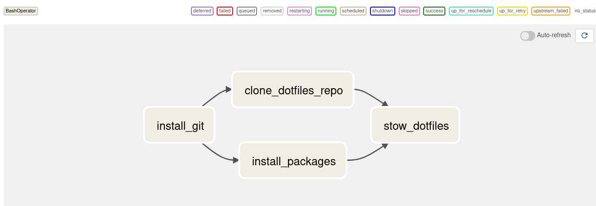

+++
title = "Bootstrapping dev environment setup with Airflow"
date = 2022-10-28
description = "Bootstrapping my developement environment setup with Airflow. Why? Because why not!"
[extra]
image="posts/dev-env-setup-with-airflow/og.png"
image_desc="An image containing rectangular boxes connected by arrows representing a graph."
+++

> Disclaimer: this is just an experiment.
There are tools out there, like Ansible, that handle tasks like these much better.

I recently came across an interesting video on Youtube titled [Don't Use Apache Airflow](https://www.youtube.com/watch?v=YQ056EKzCyw).
This video talks about Airflow's identity crisis—how it's promoted as an ETL tool when in fact, it has no ETL specific functionalities.

When starting out, I too got the impression that Airflow was an ETL tool.
It was a while until I realized that it had no ETL specific functionalities and that it was just a highly sophisticated job scheduler.
So this little experiment is an attempt to shed light on the fact that Airflow is just a job scheduler and hence can be used for *any* kind of scheduled work.

## The Workflow
The goal here is to bootstrap my dev environment setup.
A major portion of it includes installing necessary packages and setting them up the way I configured them.
So, breaking it down, the tasks that need to be accomplished are:

1. Install git.
2. Install necessary packages.
3. Clone my dotfiles repository.
4. Stow the dotfiles.

I separate installing git from installing other packages as, while not in this case, I use git to clone programs to build them from source.

Once git is installed, installing other packages and cloning the dotfiles repository can happen in parallel as there is no dependency between the two tasks.
Finally, once the necessary packages are installed and the dotfiles are cloned, the dotfiles are symlinked to the required locations using GNU Stow.

## The Code
Airflow represents workflows as directed acyclic graphs (DAGs).
The acyclic property prevents us from running into circular dependencies between tasks.

Let's define a DAG to represent the workflow.

```py
dag = DAG(
    dag_id="dev_env_setup_dag",
    start_date=airflow.utils.dates.days_ago(0),
    schedule_interval=None,
)
```
Since the workflow is run once during initial setup, the `schedule_interval` for the dag is set to `None`.

Now defining the tasks specified above as tasks associated with the DAG we just created.

```py
install_git = BashOperator(
    task_id="install_git",
    bash_command="echo $PASSWORD | sudo -S dnf install git",
    dag=dag,
)

clone_dotfiles_repo = BashOperator(
    task_id="clone_dotfiles_repo",
    bash_command="git clone https://codeberg.org/chaoticenginerd/infra.git $HOME/infra",
    dag=dag,
)

# Specify the packages to install
packages = [
    "neovim",
    "starship",
    "stow",
    "tmux",
    "trash-cli",
]

install_packages = BashOperator(
    task_id="install_packages",
    bash_command=f"echo $PASSWORD | sudo -S dnf install {' '.join(packages)}",
    dag=dag,
)

# Specifying the dotfiles to stow
stow_dirs = [
    "bin",
    "nvim",
    "starship",
    "tmux",
]
stow_dotfiles = BashOperator(
    task_id="stow_dotfiles",
    bash_command=f"cd $HOME/infra/dotfiles/ && stow -t ~ {' '.join(stow_dirs)}",
    dag=dag,
)
```

With all the tasks specified and associated with our DAG, we now specify the order in which these tasks are supposed to run.

```py
tasks = [install_git, [clone_dotfiles_repo, install_packages], stow_dotfiles]
airflow.models.baseoperator.chain(*tasks)
```

The `clone_dotfiles_repo` and `install_packages` are grouped together to specify that they are to be run in parallel.

The complete code for the DAG can be found over on [Codeberg](https://codeberg.org/chaoticenginerd/dataswamp/src/branch/main/dev_env_setup_dag.py).

## The Result
This is what the bootstrap DAG looks like.


A successful run of the DAG will now install the necessary packages, clone my dotfiles repository, and stow my dotfiles to configure my development environment and programs the way I like them.

Once again, I would like to mention that this is not very efficient.
There are tools out there, like Ansible, which do a much better job for tasks like these.
This was just an experiment to try and use Airflow for tasks other than those related to data pipelines.
